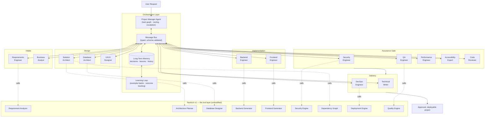
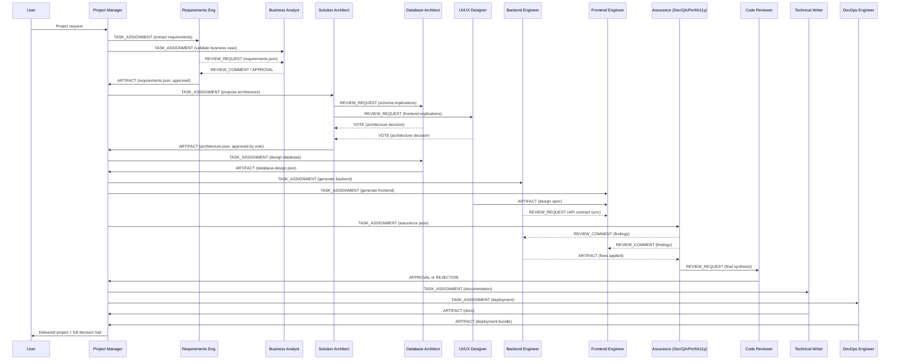
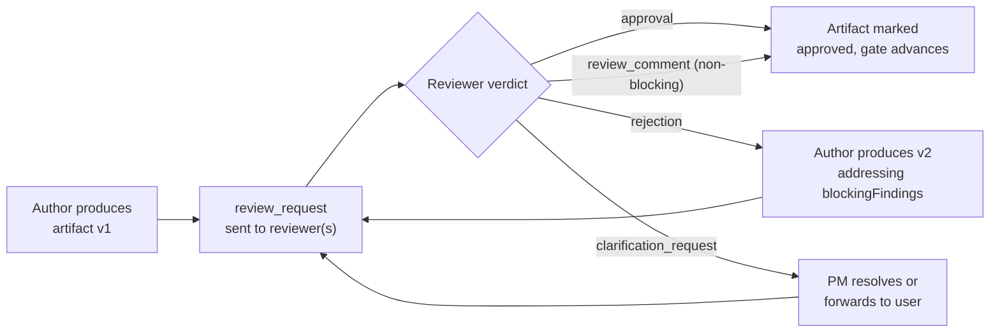
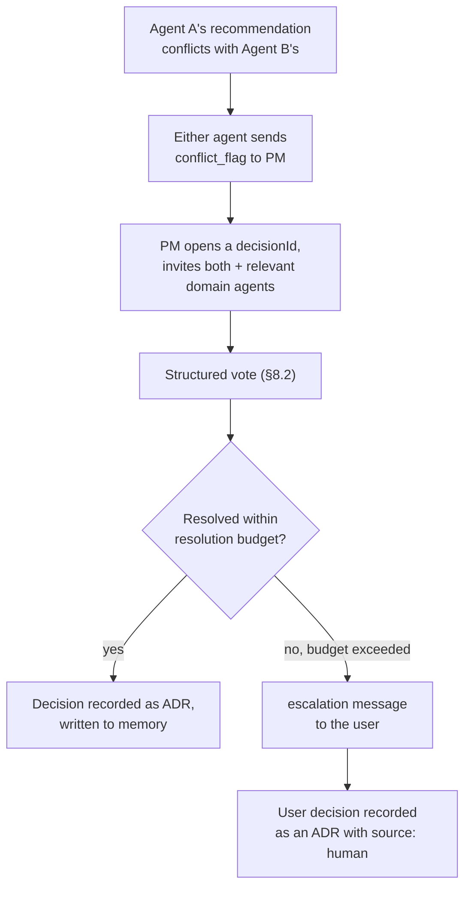
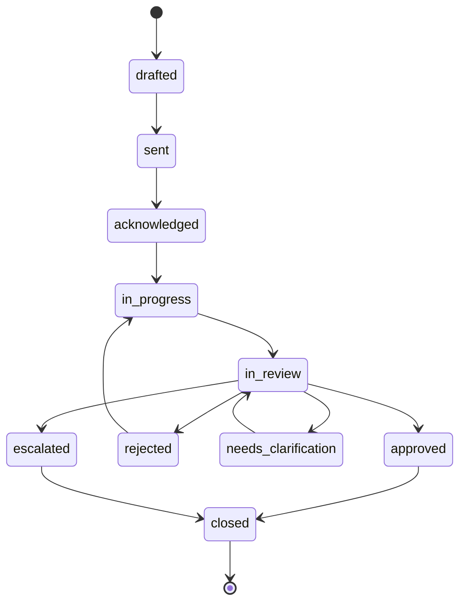

# NexArch 2.0 — Autonomous Multi-Agent Engineering Platform

**Status:** Design / Roadmap document. Nothing in this document is implemented. NexArch v1.0's architecture, modules, and code are unaffected and unmodified by this proposal.
**Scope:** This document is the complete design for NexArch 2.0 — a future major version that would run alongside or replace the v1 pipeline, not a description of anything currently running.

---

## 1. Executive Summary

NexArch 1.0 is an **AI-assisted pipeline**: one orchestrator routes a prompt through twelve deterministic engineering stages (requirements → architecture → database → backend → frontend → security → dependency graph → AI orchestration → workspace → deployment → quality → export), each stage a single AI call (or a handful) producing one artifact that the next stage consumes. It is fast, predictable, and auditable — and it has exactly one opinion at each step, because exactly one model produces each artifact.

NexArch 2.0 replaces the single opinion with a **deliberating team**. Fifteen specialized agents — each with a narrow mandate, a domain vocabulary, and the authority to reject work that doesn't meet its bar — collaborate the way a real engineering organization does: proposals get reviewed, architectural decisions get voted on, conflicting recommendations get negotiated, and nothing ships without the sign-off of everyone who has to live with it. The system gains a long-term memory of every decision it has made and why, and a learning loop that lets each agent get measurably better at its job from the outcomes of its past work.

The result NexArch 2.0 targets is not "a bigger prompt." It's an artifact-producing organization with its own governance, memory, and improvement loop — the kind of system that is publishable as multi-agent-systems research and defensible as a commercial platform, because its value isn't the underlying model, it's the coordination structure wrapped around it.

---

## 2. Design Principles

1. **Specialization over generality.** Each agent has a narrower mandate than the model powering it is capable of. A Security Engineer agent that only ever evaluates security is more consistent and more auditable than one general agent asked to "also think about security."
2. **No artifact ships without review.** Every output has a defined reviewer set. An artifact with zero required reviewers is a modeling bug, not a fast path.
3. **Disagreement is data, not failure.** When two agents' recommendations conflict, the system does not silently pick one — it records the conflict, resolves it through a defined protocol, and keeps the losing argument in memory for next time.
4. **Memory outlives the session.** A decision made in project #1 should inform project #400. Lessons learned are a first-class, queryable artifact, not a chat transcript nobody re-reads.
5. **Everything is a structured message.** Agents never communicate in free text between each other — every inter-agent exchange is a typed, schema-validated message, which is what makes the system's behavior inspectable, replayable, and improvable.
6. **The Project Manager coordinates; it does not dictate.** Orchestration (task graph, routing, deadlines) is centralized for efficiency; technical decisions are decentralized to whichever agents own the domain, with voting for cases that cross domains.
7. **v1 is a subsystem, not a relic.** Every v1 module (Requirement Analyzer, Architecture Planner, Database Designer, generators, Security Engine, Dependency Graph, AI Orchestrator, Workspace, Deployment, Quality Engine) becomes the **tool an agent calls**, not code to be rewritten. A v2 Backend Engineer agent's "generate backend code" action _is_ a call into the existing, verified `backend-generator` module. v2 is a reasoning and coordination layer on top of v1's execution layer.

---

## 3. Multi-Agent Architecture

### 3.1 System overview



Every double-headed arrow into the Message Bus is a typed message (§6–7). Every dotted arrow into the v1 tool layer is an ordinary function/HTTP call into an existing, already-verified NexArch module — v2 agents don't reimplement generation, they decide _when_, _how_, and _whether_ to invoke it, and they review what comes back.

### 3.2 Agent taxonomy

| Cluster            | Agents                                                                                    | Cluster mandate                                                                               |
| ------------------ | ----------------------------------------------------------------------------------------- | --------------------------------------------------------------------------------------------- |
| **Intake**         | Requirements Engineer, Business Analyst                                                   | Turn an ambiguous prompt into a validated, business-justified specification                   |
| **Design**         | Solution Architect, Database Architect, UI/UX Designer                                    | Turn a specification into a reviewable, votable technical design                              |
| **Implementation** | Backend Engineer, Frontend Engineer                                                       | Turn an approved design into working code against a frozen contract                           |
| **Assurance**      | Security Engineer, QA Engineer, Performance Engineer, Accessibility Expert, Code Reviewer | Independently attack the implementation from five angles before anything is called done       |
| **Delivery**       | Technical Writer, DevOps Engineer                                                         | Turn approved code into something a team can run, deploy, and understand                      |
| **Governance**     | Project Manager                                                                           | Own the task graph, routing, memory writes, and deadlock resolution across all other clusters |

---

## 4. Workflow

### 4.1 Primary spine (matches the brief's requested order, expanded with parallelism where real teams parallelize)



### 4.2 What changed versus v1's linear pipeline

|                        | v1.0                                          | v2.0                                                           |
| ---------------------- | --------------------------------------------- | -------------------------------------------------------------- |
| Stage output           | Produced once, consumed once                  | Produced, reviewed, potentially rejected, revised, re-reviewed |
| Cross-domain conflicts | Impossible to represent (one model, one pass) | First-class: recorded, voted, resolved, remembered             |
| "Is this good enough?" | Implicit in the generator's own logic         | Explicit: a defined reviewer set must approve                  |
| Failure mode           | Silent — a bad decision propagates downstream | Loud — a rejection blocks the spine until resolved             |
| History                | The current project's artifacts only          | Every past decision, correction, and outcome, queryable        |

---

## 5. Agent Responsibilities

Every agent follows the same contract: it receives structured artifacts, performs one specialized analysis, produces structured outputs, reviews the specific upstream agents that feed it, and can reject, request clarification from, or suggest improvements to any artifact in its review scope.

| Agent                     | Primary inputs                                                 | Primary outputs                                                                                           | Reviews                                                                                    | Can reject                                                                                                              |
| ------------------------- | -------------------------------------------------------------- | --------------------------------------------------------------------------------------------------------- | ------------------------------------------------------------------------------------------ | ----------------------------------------------------------------------------------------------------------------------- |
| **Project Manager**       | User request, full task graph, agent status feed               | Task assignments, schedule, escalation decisions, tie-break rulings                                       | Nothing technical — reviews _process_ (is an agent stalled, is a dependency cycle forming) | A stalled or non-responsive agent's task, reassigning it                                                                |
| **Requirements Engineer** | User prompt, prior project memory                              | `requirements.json` (spec, roles, modules, NFRs)                                                          | — (first agent in the spine)                                                               | Nothing upstream; can flag the prompt itself as underspecified and request clarification from the user                  |
| **Business Analyst**      | `requirements.json`                                            | Business validation report, prioritized feature list, risk flags                                          | Requirements Engineer's spec, for business coherence and scope realism                     | An unjustified or scope-inflated requirement                                                                            |
| **Solution Architect**    | Validated requirements, business report, past ADRs from memory | `architecture.json`, Architecture Decision Records (ADRs)                                                 | Database Architect's and UI/UX Designer's proposals, for system-level coherence            | A schema or design proposal that breaks the chosen architecture pattern                                                 |
| **Database Architect**    | `architecture.json`                                            | `database-design.json`, `schema.prisma`, `schema.sql`, migration plan                                     | Solution Architect's data-flow assumptions                                                 | An architecture proposal with an unsupportable data model                                                               |
| **UI/UX Designer**        | `requirements.json`, `architecture.json`                       | Design spec (information architecture, component inventory, interaction spec, accessibility baseline)     | Solution Architect's frontend architecture decisions                                       | A frontend architecture that can't support the required user flows                                                      |
| **Backend Engineer**      | `architecture.json`, `database-design.json`, OpenAPI contract  | Backend source, `backend-manifest.json`                                                                   | Database Architect's schema (implementability), API contract completeness                  | A schema that can't be implemented as specified                                                                         |
| **Frontend Engineer**     | `architecture.json`, OpenAPI contract, UI/UX design spec       | Frontend source, `frontend-manifest.json`                                                                 | UI/UX Designer's spec (implementability), Backend Engineer's contract (completeness)       | An API contract that doesn't cover a required UI flow                                                                   |
| **Security Engineer**     | Backend + frontend manifests, architecture                     | `security-report.json`, hardening patches                                                                 | Backend and Frontend Engineers' output for OWASP/auth/authz gaps                           | Any artifact with an unresolved critical/high finding                                                                   |
| **QA Engineer**           | Backend + frontend manifests, requirements                     | Test suites, `testing-report.json`, coverage assessment                                                   | All implementation output against the original requirements                                | An artifact that fails its own generated tests or misses acceptance criteria                                            |
| **Performance Engineer**  | Backend + frontend manifests, dependency graph                 | `performance-report.json`, optimization recommendations                                                   | Implementation output for bundle size, query patterns, N+1 risks                           | An artifact with a flagged performance regression above threshold                                                       |
| **Accessibility Expert**  | Frontend manifest, UI/UX design spec                           | Accessibility audit (WCAG 2.2 AA checklist), remediation list                                             | Frontend Engineer's output and UI/UX Designer's spec                                       | A frontend artifact with an unresolved AA-blocking violation                                                            |
| **Code Reviewer**         | Every Assurance-cluster report, full diff                      | Final synthesis verdict, review comments                                                                  | Everyone in Implementation and Assurance — the last gate before Delivery                   | Any artifact until every Assurance finding it's responsible for is resolved or explicitly waived with a recorded reason |
| **Technical Writer**      | All approved artifacts                                         | README, architecture docs, API docs, guides (the v1 Quality Engine's 10-document package, agent-authored) | Nothing — consumes only approved artifacts                                                 | Can request clarification if an artifact's rationale isn't reconstructable from what it was given                       |
| **DevOps Engineer**       | Approved backend + frontend, deployment target                 | Docker/CI-CD/environment bundle, deployment readiness verdict                                             | Implementation output for deployability (config completeness, health endpoints)            | An artifact missing a required deployment prerequisite (e.g., no health check, no env template)                         |

---

## 6. Communication Protocol

### 6.1 Message envelope

Every inter-agent exchange — task assignment, review, vote, clarification, rejection — is one instance of a single envelope shape. Payload varies by `messageType`; the envelope never does.

```typescript
interface AgentMessage<TPayload = unknown> {
  id: string; // ULID, globally unique, sortable by creation time
  conversationId: string; // groups a request → response → follow-up chain
  sender: AgentId;
  receiver: AgentId | 'broadcast'; // 'broadcast' only for PM announcements
  messageType: MessageType; // see §6.3
  task: {
    id: string; // stable task identifier from the PM's task graph
    title: string;
    description: string;
  };
  artifacts: ArtifactRef[]; // pointers, not inline blobs — see §7.2
  priority: Priority; // see §6.2
  status: MessageStatus; // see §6.2
  dependencies: string[]; // task IDs that must reach a terminal status first
  createdAt: string; // ISO 8601
  respondBy?: string; // ISO 8601 SLA, set by the PM for time-sensitive tasks
}

type AgentId =
  | 'project-manager'
  | 'requirements-engineer'
  | 'business-analyst'
  | 'solution-architect'
  | 'database-architect'
  | 'ui-ux-designer'
  | 'backend-engineer'
  | 'frontend-engineer'
  | 'security-engineer'
  | 'qa-engineer'
  | 'performance-engineer'
  | 'accessibility-expert'
  | 'code-reviewer'
  | 'technical-writer'
  | 'devops-engineer';
```

### 6.2 Priority and status

```typescript
type Priority =
  | 'P0-blocking' // the whole spine is stalled until this resolves
  | 'P1-critical' // must resolve before the current stage's gate
  | 'P2-standard' // normal task flow
  | 'P3-advisory'; // suggestion, doesn't block anything

type MessageStatus =
  | 'drafted'
  | 'sent'
  | 'acknowledged'
  | 'in_progress'
  | 'in_review'
  | 'needs_clarification'
  | 'approved'
  | 'rejected'
  | 'escalated'
  | 'closed';
```

Status is a strict state machine (§8.4 shows the transition diagram) — an agent cannot jump from `sent` to `approved` without passing through `in_review`, and cannot self-approve its own output (a `messageType: 'approval'` payload's `sender` must differ from the artifact's original author).

### 6.3 Message types

| `messageType`           | Purpose                                            | Typical sender → receiver                  |
| ----------------------- | -------------------------------------------------- | ------------------------------------------ |
| `task_assignment`       | PM hands an agent a unit of work                   | PM → any agent                             |
| `artifact_delivery`     | An agent's output, ready for consumption or review | any agent → PM / downstream agent          |
| `review_request`        | "Look at this before I call it done"               | any agent → its defined reviewer(s)        |
| `review_comment`        | Non-blocking feedback on an artifact               | reviewer → author                          |
| `approval`              | Formal sign-off, required for gate advancement     | reviewer → author, cc: PM                  |
| `rejection`             | Formal block, must include a remediation reason    | reviewer → author, cc: PM                  |
| `clarification_request` | "I can't proceed without more information"         | any agent → PM or upstream agent           |
| `vote`                  | One agent's position in an architectural decision  | design-cluster agent → Solution Architect  |
| `conflict_flag`         | Two artifacts/recommendations are incompatible     | any agent → PM                             |
| `escalation`            | A conflict or stall exceeded its resolution budget | PM → user (or a designated human reviewer) |

---

## 7. Message Schemas

### 7.1 Task assignment payload

```typescript
interface TaskAssignmentPayload {
  objective: string; // what "done" looks like, in one sentence
  inputArtifacts: ArtifactRef[];
  constraints: string[]; // e.g. "must not modify database-design.json"
  acceptanceCriteria: string[];
  relevantMemory: MemoryQueryResult[]; // ADRs / lessons-learned pre-fetched by the PM
}
```

### 7.2 Artifact reference

Artifacts are never inlined into messages — a message carries a reference, and the artifact itself lives in the project's artifact store (the same store v1's Workspace module already provides).

```typescript
interface ArtifactRef {
  artifactId: string;
  kind:
    | 'requirements'
    | 'architecture'
    | 'database-design'
    | 'backend-manifest'
    | 'frontend-manifest'
    | 'security-report'
    | 'design-spec'
    | 'test-suite'
    | 'deployment-bundle'
    | 'documentation';
  version: number; // artifacts are immutable; a revision is a new version
  producedBy: AgentId;
  contentHash: string; // integrity check + dedup key for the learning loop
  uri: string; // pointer into the artifact store
}
```

### 7.3 Review comment

```typescript
interface ReviewCommentPayload {
  artifactId: string;
  artifactVersion: number;
  severity: 'blocking' | 'major' | 'minor' | 'suggestion';
  location?: string; // file path, JSON path, or schema field
  finding: string; // what's wrong
  recommendation: string; // what would fix it
  category: string; // agent-defined taxonomy, e.g. 'owasp-a01', 'n+1-query', 'wcag-2.4.7'
}
```

### 7.4 Vote (architectural decisions)

```typescript
interface VotePayload {
  decisionId: string; // one decisionId per architectural question raised
  question: string;
  optionsConsidered: { option: string; proposedBy: AgentId }[];
  vote: string; // must be one of optionsConsidered
  rationale: string;
  confidence: 'high' | 'medium' | 'low';
  vetoOverride: boolean; // true only for a domain-authority veto — see §8.2
}
```

### 7.5 Rejection

```typescript
interface RejectionPayload {
  artifactId: string;
  artifactVersion: number;
  blockingFindings: ReviewCommentPayload[]; // every finding must be severity: 'blocking'
  requiredAction: string;
  resubmissionDeadline?: string;
}
```

### 7.6 Clarification request

```typescript
interface ClarificationRequestPayload {
  question: string;
  context: string;
  blockedTaskIds: string[];
  suggestedAnswers?: string[]; // the requester's best guesses, so the answerer can just pick one
  escalatesToUserAfter?: string; // ISO 8601 — if unanswered by another agent, the PM forwards to the user
}
```

---

## 8. Collaboration Mechanics

### 8.1 Review cycle

Every artifact goes through the same four-step cycle regardless of which agent produced it:



### 8.2 Voting on architectural decisions

Cross-domain decisions (e.g., "should this be a monolith or split by bounded context," "REST or GraphQL," "which caching layer") are decided by **weighted quorum vote**, not by whichever agent speaks first:

1. The Solution Architect frames the question and lists the options (it always gets a vote, as the tie-break-adjacent role, but doesn't get to dictate the answer).
2. Every agent whose domain the decision materially affects casts a `vote` message. A decision about database access patterns pulls in the Database Architect and Performance Engineer; a decision about the auth flow pulls in the Security Engineer and Backend Engineer.
3. **Domain authority weighting**: a vote from the agent whose specialty the question falls squarely inside counts double (e.g., the Security Engineer's vote on an auth-flow question). This prevents a 4-1 vote from overriding the one agent who actually understands the failure mode.
4. A single agent may cast `vetoOverride: true` **only** within its own domain of authority (Security can veto on a security-critical finding; Accessibility can veto on a WCAG blocking violation) — this is rare, logged with mandatory rationale, and immediately visible to the Project Manager and Code Reviewer.
5. Ties, after weighting, escalate to the Project Manager, who breaks them using project memory (§9) — "what did we decide last time a materially similar question came up, and how did it turn out?" — not arbitrary preference.

### 8.3 Conflict resolution



The "resolution budget" is a bounded number of vote rounds (default: 2) — this is what prevents two agents from looping forever instead of shipping. A conflict that survives two structured rounds is, by definition, a decision that needs a human, not more agent deliberation.

### 8.4 Message status state machine



### 8.5 Rejecting invalid outputs

Rejection is not a soft "revise if you feel like it" — it is a hard gate. The task graph edge from a rejected artifact to its downstream consumers is marked blocked until a new version reaches `approved`. The Code Reviewer's synthesis step (§5) is specifically the agent responsible for confirming that _every_ blocking finding across Security, QA, Performance, and Accessibility has actually been resolved — not just acknowledged — before Delivery starts.

---

## 9. Long-Term Project Memory

### 9.1 What's tracked

| Category               | Example                                                                                                                          | Retention                                         |
| ---------------------- | -------------------------------------------------------------------------------------------------------------------------------- | ------------------------------------------------- |
| Architecture decisions | "Chose event-driven over request/response for the notification module because Backend Engineer flagged a fan-out latency risk"   | Permanent, versioned (ADR format)                 |
| Past prompts           | The original user request, verbatim, plus the Requirements Engineer's extracted spec                                             | Permanent                                         |
| Previous generations   | Every artifact version ever produced, with its approval/rejection trail                                                          | Permanent, content-addressed                      |
| Developer overrides    | A human manually changing a generated value after the agents approved it                                                         | Permanent, flagged high-signal for learning (§10) |
| Manual edits           | Any post-generation edit to a file the Dependency Graph tracks as "manually edited" (v1 already tracks this per-file provenance) | Permanent                                         |
| Lessons learned        | A structured, agent-authored postmortem: what was tried, what failed, why, what to do differently                                | Permanent, semantically indexed                   |

### 9.2 Storage model

Two complementary stores, not one:

- **Decision log** — an append-only, ADR-formatted record (`{ decisionId, question, options, decision, rationale, decidedBy, votes[], timestamp }`), queried by exact ID or by project. This is the system of record for "why does this project look the way it does."
- **Lessons-learned index** — the same category of record, but embedded and stored in a vector index so agents can retrieve _semantically similar_ past situations, not just past decisions on the identical question. Before the Solution Architect proposes a pattern, it queries: "have we seen a request shaped like this before, and what happened?"

### 9.3 How agents use memory

Every `TaskAssignmentPayload` the Project Manager sends is pre-populated with `relevantMemory` (§7.1) — the PM runs the semantic query on the agent's behalf before the task even starts, so no agent has to remember to check. This is the mechanism that turns "the 400th project" into a system that's measurably better-informed than the first one, without retraining anything.

---

## 10. Learning System

Two loops, deliberately different in cost and maturity, so the system starts improving immediately and only reaches for expensive machinery once there's enough signal to justify it.

### 10.1 Loop 1 — Exemplar bank evolution (default, always on)

Each agent maintains a small, curated bank of past (input → approved output) pairs, used as few-shot context on future tasks. The bank evolves from four recorded signal types:

| Signal                                                                    | Effect                                                                                                                                   |
| ------------------------------------------------------------------------- | ---------------------------------------------------------------------------------------------------------------------------------------- |
| **Successful generation** — approved with zero rejections                 | Candidate for the exemplar bank; promoted if it later also survives a real deployment without a reported regression                      |
| **Failed generation** — rejected one or more times                        | Removed from consideration; the rejection reason is stored in the lessons-learned index as a negative exemplar ("don't do this when...") |
| **Review feedback** — a `review_comment` even on an approved artifact     | Attached to that exemplar as an annotation, so future retrieval surfaces the caveat along with the good example                          |
| **User correction** — a human manually changes agent output post-approval | Highest-signal input: the exemplar is demoted regardless of its approval history, and the correction becomes a new negative exemplar     |

### 10.2 Loop 2 — Outcome-weighted prompt refinement (matures over time)

Once an agent has enough tracked outcomes (default threshold: 50 completed tasks), its prompt template becomes a **versioned artifact** like any other. A scheduled process proposes prompt edits targeting the categories of rejection that recur most often for that agent, A/B-tests the candidate prompt against the incumbent on held-out historical tasks (replaying real past inputs, scoring against the real recorded approval outcome), and promotes it only if it measurably reduces the rejection rate without increasing task latency.

### 10.3 What v2 deliberately does not do at launch

Fine-tuning a model per agent is real future scope (§12) but is not the initial mechanism — it requires far more labeled outcome data than a young system has, and it recouples an agent's behavior to a specific model/provider in a way the exemplar-bank approach doesn't. Loop 1 and Loop 2 both work with any model behind the AI Orchestrator's existing provider abstraction (Claude, OpenAI, Gemini, OpenRouter) unmodified.

---

## 11. Quality Gates

Every artifact has a **required approver set** — the minimum agents who must reach `approved` before the artifact can be consumed downstream. No artifact reaches "final" by default; it reaches final because its required approvers said so.

| Artifact                     | Required approvers                                                                                                          |
| ---------------------------- | --------------------------------------------------------------------------------------------------------------------------- |
| `requirements.json`          | Business Analyst                                                                                                            |
| `architecture.json`          | Database Architect, UI/UX Designer (vote, §8.2)                                                                             |
| `database-design.json`       | Solution Architect, Backend Engineer                                                                                        |
| Backend code                 | Security Engineer, QA Engineer, Performance Engineer, Code Reviewer                                                         |
| Frontend code                | Security Engineer (XSS/CSRF surface), QA Engineer, Performance Engineer, Accessibility Expert, Code Reviewer                |
| Deployment bundle            | DevOps Engineer, Security Engineer (secrets/config check)                                                                   |
| Documentation package        | Technical Writer self-certifies against a completeness checklist; Code Reviewer spot-checks accuracy against the final code |
| **Project — overall "done"** | Code Reviewer's final synthesis, which itself requires every row above to already be `approved`                             |

---

## 12. Proposed Folder Structure

Additive only. Nothing under `server/src/modules/` or `client/src/` from v1 changes; v2 lives in new, parallel trees that call into v1 as a library/API.

```
server/
  src/
    modules/                    # v1 — unchanged
      ...

    agents/                     # v2 — new
      shared/
        agent-contract.ts       # the interface every agent implements
        message-bus.ts          # typed pub/sub, schema-validates every message
        message.types.ts        # AgentMessage, all payload types (§7)
        task-graph.ts           # dependency-aware task scheduler
        state-machine.ts        # message status transitions (§8.4)

      orchestrator/
        project-manager.agent.ts
        escalation.ts
        conflict-resolution.ts  # voting + veto + resolution-budget logic (§8.2–8.3)

      requirements-engineer/
        requirements-engineer.agent.ts
        requirements-engineer.prompts.ts    # versioned exemplar bank (§10)
      business-analyst/
      solution-architect/
      database-architect/
      ui-ux-designer/
      backend-engineer/
      frontend-engineer/
      security-engineer/
      qa-engineer/
      performance-engineer/
      accessibility-expert/
      code-reviewer/
      technical-writer/
      devops-engineer/
        # each agent folder follows the same shape as requirements-engineer/ above

      memory/
        decision-log.ts         # ADR store (§9.2)
        lessons-learned.ts      # vector-indexed retrieval (§9.2)
        memory-query.ts         # the PM's pre-fetch used to populate relevantMemory

      learning/
        exemplar-bank.ts        # Loop 1 (§10.1)
        prompt-refinement.ts    # Loop 2 (§10.2)
        outcome-tracker.ts      # records success/failure/correction signals

      quality-gates/
        approval-matrix.ts      # the table in §11, as data
        gate-evaluator.ts       # "is this artifact allowed to advance?"

    modules/agents-api/         # v2's own thin AppModule
      agents.router.ts          # POST /api/v2/agents/run, GET /api/v2/agents/:conversationId
      agents.controller.ts

client/
  src/
    features/
      agent-console/            # v2 — new. Not the v1 pipeline pages; a live view
        agent-console-page.tsx  # of the task graph, message stream, and decision log
        components/
          task-graph-view.tsx   # visual task DAG with live status
          message-stream.tsx    # the AgentMessage feed, filterable by agent/type
          decision-log-view.tsx # browsable ADR history
          vote-panel.tsx        # live view of an in-progress vote
```

---

## 13. Future Implementation Roadmap

Numbered as v2 milestones, not a continuation of v1's Phase 1–12 — v2 is a new major version built on top of, not inside, the existing phase sequence.

| Milestone                                     | Scope                                                                                                                                                                                                                            | Depends on                                                            |
| --------------------------------------------- | -------------------------------------------------------------------------------------------------------------------------------------------------------------------------------------------------------------------------------- | --------------------------------------------------------------------- |
| **M0 — Protocol foundation**                  | `message.types.ts`, `message-bus.ts`, `task-graph.ts`, `state-machine.ts`. No agents yet — just the substrate every agent will run on, tested with synthetic messages.                                                           | v1 (as a library)                                                     |
| **M1 — Single-agent proof**                   | One agent (Requirements Engineer) wraps the existing v1 Requirement Analyzer, communicates only with a stub Project Manager, writes to a real decision log. Proves the message protocol against one real, already-verified tool. | M0                                                                    |
| **M2 — Design cluster + voting**              | Solution Architect, Database Architect, UI/UX Designer online; implement the weighted-vote and conflict-resolution mechanics (§8.2–8.3) for real, on real architecture decisions.                                                | M1                                                                    |
| **M3 — Implementation + Assurance clusters**  | Backend/Frontend Engineers, then all five Assurance agents; implement the full review cycle (§8.1) and quality gates (§11). This is the milestone where rejection loops get exercised for the first time end-to-end.             | M2                                                                    |
| **M4 — Delivery cluster + full spine**        | Technical Writer, DevOps Engineer; first fully autonomous run of a real project request through all 15 agents.                                                                                                                   | M3                                                                    |
| **M5 — Long-term memory**                     | Decision log + lessons-learned vector index live; the PM starts pre-fetching `relevantMemory` on every task.                                                                                                                     | M4                                                                    |
| **M6 — Learning Loop 1**                      | Exemplar banks per agent, populated from M4/M5's accumulated real outcomes.                                                                                                                                                      | M5, and enough completed projects to have real outcomes to learn from |
| **M7 — Agent Console UI**                     | The client-side task graph / message stream / decision log viewer (§12).                                                                                                                                                         | M4 (needs a real message stream to visualize)                         |
| **M8 — Learning Loop 2**                      | Outcome-weighted prompt refinement, once an agent crosses its outcome-count threshold.                                                                                                                                           | M6, sustained production usage                                        |
| **M9 — Research publication + external eval** | Formal evaluation against the benchmark in §14, paper submission.                                                                                                                                                                | M6–M8, enough real usage data to report on                            |

---

## 14. Research Paper Outline

**Working title:** _NexArch 2.0: A Multi-Agent Architecture for Autonomous, Auditable Software Engineering_

1. **Abstract** — the gap between single-model code generation and organizational software engineering; the contribution is the coordination structure (protocol, voting, memory, learning), not a new base model.
2. **Introduction** — motivate with the "one model, one opinion" failure mode of pipeline-style generators; state the thesis that engineering quality emerges from review and disagreement, not just generation quality.
3. **Related Work** — single-agent code generation (Copilot-style, pipeline generators including NexArch v1); multi-agent LLM frameworks (debate-based, role-playing, AutoGen/MetaGPT-style role pipelines); software engineering process modeling (ADRs, code review research, CI/CD as a discipline); long-term agent memory (RAG-based memory, vector-indexed lessons-learned systems). Position NexArch 2.0's contribution specifically: a _typed, schema-validated protocol with weighted voting and a bounded conflict-resolution budget_, evaluated against real generated software, not toy tasks.
4. **System Design** — §§3–13 of this document, condensed: agent taxonomy, message protocol, voting/conflict resolution, memory, learning loops.
5. **Methodology / Evaluation Design**
   - RQ1: Does multi-agent review measurably reduce defect rate versus v1's single-pass generation, on the same prompt set?
   - RQ2: Does the weighted-vote conflict resolution converge faster / produce decisions humans agree with more often than an unweighted baseline?
   - RQ3: Does memory-informed task assignment (relevantMemory pre-fetch) improve first-pass approval rate over successive, related projects?
   - RQ4: Does Learning Loop 1 (exemplar banks) reduce an agent's rejection rate over its first N tasks?
   - Benchmark: a held-out set of prompts spanning the same domain categories NexArch v1's own test suite already covers (CRM, hospital, e-commerce, etc.), scored by NexArch's own Quality Engine (Phase 12) as an _independent_ evaluator — reusing v1's engineering-score methodology as the paper's evaluation metric is itself a contribution (the platform grades its own successor with a tool the successor doesn't control).
6. **Results** — quantitative: engineering score distributions v1 vs v2, defect/rejection rates, conflict-resolution convergence time, memory-hit-rate vs. approval-rate correlation. Qualitative: case studies of specific recorded conflicts and how they resolved.
7. **Discussion** — where agent specialization helped vs. added coordination overhead; failure modes observed (deadlocked votes, memory retrieval that surfaced misleading precedent); cost/latency tradeoff of review cycles vs. single-pass generation.
8. **Limitations** — evaluation is self-graded by a NexArch-family tool (mitigated by using the _v1_ Quality Engine, not the v2 agents, as the evaluator, but still an in-family metric); no comparison yet against other published multi-agent SE frameworks on identical prompts; Learning Loop 2 requires production-scale data this paper may not yet have at submission time.
9. **Conclusion** — coordination structure, not model scale, is the lever this work argues for.
10. **References** — multi-agent LLM systems, software engineering process literature, ADR/decision-record literature, RAG/long-term-memory literature.

---

## 15. Commercialization Strategy

### 15.1 Positioning

NexArch 1.0 competes as "a very good AI code generator." NexArch 2.0 competes as **an engineering team you don't have to hire** — the pitch shifts from "generates code fast" to "makes the same decisions a senior team would, with the same review discipline, and remembers every decision it's ever made about your systems." The defensible claim isn't generation speed (every competitor has that); it's the audit trail: every architectural choice has a recorded rationale, a vote, and a reviewer.

### 15.2 Target segments

| Segment                                                             | Why v2 specifically (not just v1)                                                                                      | Wedge                                                                                                               |
| ------------------------------------------------------------------- | ---------------------------------------------------------------------------------------------------------------------- | ------------------------------------------------------------------------------------------------------------------- |
| Engineering teams evaluating AI-generated code for production use   | The approval matrix (§11) and decision log (§9) are exactly the artifacts a security/compliance review asks for anyway | "Show me why" — every generated decision comes with its vote record                                                 |
| Startups building an MVP that needs to survive its first real audit | Gets senior-team review discipline without hiring a senior team                                                        | Free/low tier on the full spine, paid tier on memory retention + learning loop                                      |
| Enterprises with existing NexArch v1 deployments                    | Direct upgrade path — v1 artifacts and history become v2's memory seed on day one                                      | Zero-migration-cost story: "your v1 project history is already v2's memory"                                         |
| Research labs / academic partners                                   | The protocol and evaluation methodology (§14) are independently interesting even without commercial intent             | Open the protocol schema and message-bus spec; keep the trained exemplar banks and hosted orchestration proprietary |

### 15.3 Pricing shape

- **Generate** (= v1, unchanged): pay per generation, as today.
- **Engineer** (v2 spine, no persistent memory): pay per project, includes the full 15-agent review cycle and decision log for that project only.
- **Organization** (v2 + persistent memory + learning loops): subscription, memory and exemplar banks compound in value the longer a team stays, which is the retention mechanism.
- **Enterprise**: self-hosted orchestration layer, bring-your-own model provider (already supported by v1's provider abstraction), audit-log export, SSO.

### 15.4 Moat

Not the agents themselves (any team with the right prompts could roughly replicate one agent). The moat is **accumulated memory** — a customer's decision log and exemplar banks after a year of real usage are not portable to a competitor and get measurably better the longer they stay, which is a data-network-effect moat, not a model moat. This is also why the pricing shape in §15.3 is structured to make "Organization" tier retention the core unit economics, not per-generation volume.

### 15.5 Risks

| Risk                                                                                          | Mitigation                                                                                                                                                                                                  |
| --------------------------------------------------------------------------------------------- | ----------------------------------------------------------------------------------------------------------------------------------------------------------------------------------------------------------- |
| Review-cycle latency makes v2 feel slower than v1 for simple requests                         | Keep v1's direct pipeline available as "Generate" tier — v2 is opt-in for teams that want the review discipline, not a forced upgrade                                                                       |
| Multi-agent coordination cost (tokens, calls) makes v2 materially more expensive to run       | Loop 1's exemplar banks and the AI Orchestrator's existing model-router/cache directly attack this; §14's evaluation should report cost-per-approved-artifact, not just quality                             |
| Voting/conflict-resolution produces decisions a human reviewer disagrees with, damaging trust | Every decision is reversible and every ADR is human-editable; the escalation path (§8.3) exists precisely so the system asks rather than guesses when confidence is genuinely split                         |
| "Autonomous" framing overclaims — customers expect zero human involvement                     | Market it accurately as _reviewed_ autonomy: humans remain the escalation path and the final approver can always be a human role plugged into the same approval-matrix mechanism (§11) that gates any agent |

---

_This document defines a target design for future work. NexArch 1.0's twelve implemented phases, architecture, and code are unaffected._
